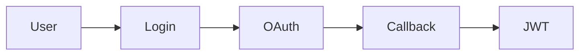

# DesignScribe — Architecture Sketch

> A CLI tool that generates architecture docs and data flow maps
> as a side effect of coding agent work.

## Problem

Coding agents (Claude Code, Cursor, Codex, etc.) write code but don't
document *why*. After a session, you have new files but no record of
the design decisions, data flows, or architectural impact. Existing
tools (depwire, Graphify) map what exists, but none narrate *what
changed and why* in real-time.

## Design Principles

1. **Unix philosophy** — composable CLI tools, pipe-friendly, NDJSON interchange
2. **Incremental** — don't re-analyze the whole codebase on every change
3. **Agent-agnostic** — works with any coding agent via file watchers or hooks
4. **Local-first** — no cloud dependencies, everything runs on-machine
5. **Living docs** — output is a markdown doc that evolves, not a static snapshot

---

## High-Level Architecture

```
┌─────────────────────────────────────────────────────────┐
│                     DesignScribe CLI                     │
├─────────────────────────────────────────────────────────┤
│                                                         │
│  ┌──────────┐   ┌──────────┐   ┌──────────┐           │
│  │  WATCH   │──▶│ ANALYSE  │──▶│ NARRATE  │           │
│  │ (detect  │   │ (parse + │   │ (LLM     │           │
│  │  changes)│   │  graph)  │   │  summary)│           │
│  └──────────┘   └──────────┘   └──────────┘           │
│       │              │              │                   │
│       ▼              ▼              ▼                   │
│  ┌──────────┐   ┌──────────┐   ┌──────────┐           │
│  │  DIFF    │   │  GRAPH   │   │ DIAGRAM  │           │
│  │ (what    │   │ (deps +  │   │ (mermaid │           │
│  │  changed)│   │  structure)  │  render) │           │
│  └──────────┘   └──────────┘   └──────────┘           │
│                      │              │                   │
│                      ▼              ▼                   │
│                 ┌──────────────────────┐                │
│                 │       OUTPUT         │                │
│                 │  living-arch.md      │                │
│                 │  diagrams/           │                │
│                 │  graph.json          │                │
│                 └──────────────────────┘                │
│                                                         │
└─────────────────────────────────────────────────────────┘
```

---

## Component Details

### 1. WATCH — Change Detection

Watches the filesystem for code changes. Two modes:

**Mode A: File Watcher (standalone)**
```
designscribe watch ./src
```
Uses `watchdog` (Python) or `chokidar` (Node) to detect file writes.
Debounces rapid changes (agent writes multiple files in quick succession).
Triggers the pipeline after a configurable idle period (default: 2s).

**Mode B: Agent Hook (integration)**
```
# In CLAUDE.md / AGENTS.md:
# After writing code, run: designscribe record <files...>
```
The coding agent explicitly calls `designscribe record` after a batch
of file writes. This is more precise — the agent knows what it changed
and can pass context (task description, rationale).

**Mode C: Git Hook (post-commit)**
```
# .git/hooks/post-commit
designscribe diff HEAD~1
```
Analyzes the last commit. Good for CI/CD integration.

**Output:** NDJSON stream of change events
```json
{"event":"change","files":["src/auth.py","src/models/user.py"],"timestamp":"2026-06-21T10:00:00Z","source":"watcher"}
```

---

### 2. DIFF — Change Analysis

Determines *what* changed at the structural level.

**Implementation:** Uses `tree-sitter` to parse both old and new versions,
then diffs the ASTs (not just text).

**What it extracts:**
- New functions/classes/methods added
- Removed symbols
- Modified signatures (parameter changes, return type changes)
- New imports/dependencies
- Removed imports/dependencies
- New files created
- Files deleted

**CLI:**
```
designscribe diff HEAD~1              # git-based diff
designscribe diff src/auth.py         # single file vs last saved
designscribe diff --staged            # staged changes
```

**Output:** NDJSON stream of structural changes
```json
{"type":"symbol_added","file":"src/auth.py","symbol":"authenticate","kind":"function","line":45}
{"type":"import_added","file":"src/auth.py","import":"bcrypt","from":"bcrypt"}
{"type":"signature_changed","file":"src/auth.py","symbol":"login","params_added":["mfa_code"]}
```

**Dependencies:**
- `tree-sitter` + language grammars (AST parsing)
- `pydifflib` or `difflib` (text diff as fallback)
- GitPython (git integration)

---

### 3. ANALYSE — Code Structure Analysis

Builds and maintains the dependency graph. Two sub-components:

**3a. Graph Builder (initial scan)**
```
designscribe init ./src
```
Scans the entire codebase, builds a directed graph:
- Nodes: files, functions, classes, modules
- Edges: imports, calls, inherits, contains

**Implementation:** Wraps `depwire` or `Graphify` as a subprocess,
or uses their libraries directly.

**3b. Graph Updater (incremental)**
```
designscribe update --files src/auth.py src/models/user.py
```
Re-parses only changed files, updates the graph incrementally.
Much faster than full re-scan.

**Graph Storage:** `designscribe-graph.json`
```json
{
  "nodes": {
    "src/auth.py:authenticate": {"type":"function","file":"src/auth.py","line":45},
    "src/models/user.py:User": {"type":"class","file":"src/models/user.py","line":12}
  },
  "edges": [
    {"from":"src/auth.py:authenticate","to":"src/models/user.py:User","type":"uses"},
    {"from":"src/auth.py","to":"bcrypt","type":"imports"}
  ]
}
```

**Dependencies:**
- `depwire` CLI (dependency graph)
- `graphify` CLI (knowledge graph, optional)
- NetworkX (graph operations, Python)

---

### 4. NARRATE — LLM Design Summary

The "novel" layer. Takes the structural diff + graph context and asks
an LLM to explain what happened and why.

**Prompt structure:**
```
You are a senior architect reviewing code changes.

## Changed Files
{file_list}

## Structural Changes
{diff_summary}

## Affected Dependencies
{graph_context — what connects to the changed code}

## Task Context (if available)
{agent's task description, if provided via `designscribe record --task "..."`}

Generate:
1. A brief summary of what was built/changed
2. The design rationale (infer from code patterns)
3. Data flow description (how data moves through the new code)
4. Impact analysis (what else might be affected)
5. Suggested Mermaid diagram (flowchart or sequence diagram)
```

**CLI:**
```
designscribe narrate                  # narrate pending changes
designscribe narrate --task "Added OAuth2 login flow"  # with context
designscribe narrate --model openrouter/auto  # specify model
```

**Output:** JSON with structured narrative
```json
{
  "summary": "Added OAuth2 authentication flow with PKCE...",
  "rationale": "Chose PKCE over implicit flow for mobile compatibility...",
  "data_flow": "User → /auth/login → OAuthProvider → callback → JWT → SessionStore",
  "impact": ["src/middleware/auth.py", "src/routes/user.py"],
  "diagram": "graph LR\n  User --> Login --> OAuth --> Callback --> JWT"
}
```

**Dependencies:**
- `call-llm` (from ai-cli toolkit) or direct OpenRouter API
- Configurable model (default: fast model for cost, e.g. mimo-v2.5-pro)

---

### 5. DIAGRAM — Mermaid Rendering

Converts the LLM-generated Mermaid syntax into images.

**CLI:**
```
designscribe diagram                  # render all pending diagrams
designscribe diagram --format png     # png, svg, pdf
designscribe diagram --output docs/   # output directory
```

**Implementation:** Pipes Mermaid text through `mmdc` (Mermaid CLI).

**Output:** `diagrams/auth-flow-2026-06-21.png` + embedded in markdown

**Dependencies:**
- `@mermaid-js/mermaid-cli` (npm) — `mmdc` command

---

### 6. OUTPUT — Living Architecture Doc

The final product. A markdown file that accumulates design decisions
over time.

**Structure:**
```markdown
# Architecture Log — Project Name

## Latest Changes

### 2026-06-21 10:00 — OAuth2 Authentication Flow
**Summary:** Added OAuth2 login with PKCE support...
**Data Flow:**


**Impact:** Affects middleware/auth.py, routes/user.py
**Files Changed:** src/auth.py, src/models/user.py

---

### 2026-06-21 09:30 — User Model Refactor
**Summary:** Extracted User model from monolithic models.py...
...
```

**CLI:**
```
designscribe render                   # regenerate living-arch.md
designscribe render --since 2026-06-01  # partial render
designscribe render --format html     # html output
```

---

## Data Flow (the tool itself)

```
File write detected
       │
       ▼
┌─────────────┐     ┌──────────────┐
│  WATCH      │────▶│  DIFF        │
│  (detect)   │     │  (tree-sitter│
│             │     │   AST diff)  │
└─────────────┘     └──────┬───────┘
                           │
                    ┌──────▼───────┐
                    │  GRAPH       │
                    │  (update     │
                    │   dep graph) │
                    └──────┬───────┘
                           │
                    ┌──────▼───────┐
                    │  NARRATE     │
                    │  (LLM call)  │
                    └──────┬───────┘
                           │
                    ┌──────▼───────┐
                    │  DIAGRAM     │
                    │  (mmdc)      │
                    └──────┬───────┘
                           │
                    ┌──────▼───────┐
                    │  OUTPUT      │
                    │  (markdown)  │
                    └──────────────┘
```

---

## File Layout

```
project-root/
├── designscribe.json          # config file
├── designscribe-graph.json    # dependency graph (persisted)
├── designscribe-log.jsonl     # append-only event log
├── living-arch.md             # the living architecture doc
└── diagrams/
    ├── auth-flow-2026-06-21.png
    └── user-model-2026-06-21.png
```

### Config (designscribe.json)
```json
{
  "watch": {
    "paths": ["src/"],
    "exclude": ["*.test.*", "*.spec.*", "node_modules/"],
    "debounce_ms": 2000
  },
  "llm": {
    "provider": "openrouter",
    "model": "xiaomi/mimo-v2.5-pro",
    "api_key_env": "OPENROUTER_API_KEY"
  },
  "diagrams": {
    "format": "png",
    "output": "diagrams/"
  },
  "output": {
    "file": "living-arch.md",
    "max_entries": 100
  },
  "graph": {
    "engine": "depwire",
    "incremental": true
  }
}
```

---

## CLI Interface

```bash
# Setup
designscribe init ./src              # first-time scan, build graph
designscribe config                  # show/edit config

# Agent integration
designscribe record src/auth.py src/models/user.py --task "Added OAuth2"
designscribe record --from-git HEAD~1  # record from git commit

# Continuous
designscribe watch ./src             # start file watcher daemon

# Manual
designscribe diff                    # show pending structural changes
designscribe narrate                 # generate narrative for pending changes
designscribe diagram                 # render diagrams
designscribe render                  # regenerate living-arch.md

# Full pipeline
designscribe run                     # diff + narrate + diagram + render

# Query
designscribe graph show              # display current dependency graph
designscribe graph query src/auth.py # what does this file depend on?
designscribe log                     # show event history
```

---

## External Tools (Building Blocks)

| Layer | Tool | Role | Install |
|-------|------|------|---------|
| Parse | tree-sitter | AST extraction | `pip install tree-sitter` |
| Parse | tree-sitter-language-pack | Language grammars | `pip install tree-sitter-language-pack` |
| Graph | depwire | Dependency mapping | `npm install -g depwire-cli` |
| Graph | NetworkX | Graph operations | `pip install networkx` |
| LLM | call-llm (ai-cli) | LLM invocation | local |
| Diagram | mermaid-cli | Render .mmd → PNG | `npm install -g @mermaid-js/mermaid-cli` |
| Git | GitPython | Git integration | `pip install gitpython` |
| Watch | watchdog | File watching | `pip install watchdog` |

---

## Implementation Phases

### Phase 1: Core Pipeline (MVP)
- [ ] `designscribe init` — scan codebase, build graph with depwire
- [ ] `designscribe diff` — tree-sitter AST diff
- [ ] `designscribe narrate` — LLM call with diff + graph context
- [ ] `designscribe diagram` — Mermaid render via mmdc
- [ ] `designscribe render` — generate living-arch.md
- [ ] `designscribe run` — full pipeline in one command

### Phase 2: Agent Integration
- [ ] `designscribe record` — agent-callable command
- [ ] `designscribe watch` — file watcher daemon
- [ ] CLAUDE.md / AGENTS.md integration snippets
- [ ] MCP server mode (for Cursor, Codex, etc.)

### Phase 3: Intelligence
- [ ] Incremental graph updates (don't re-scan everything)
- [ ] Smart debouncing (batch related changes)
- [ ] Impact analysis (what downstream code is affected)
- [ ] Design pattern detection (recognize common patterns)

### Phase 4: Polish
- [ ] HTML output with interactive diagrams
- [ ] GitHub Action (auto-generate docs on PR)
- [ ] VS Code extension sidebar
- [ ] Multiple output formats (Confluence, Notion)

---

## Open Questions

1. **Language support priority?** Python + TypeScript first? Or generic?
2. **LLM cost control?** Cache narrations? Only narrate "significant" changes?
3. **Graph engine?** depwire vs Graphify vs build our own thin wrapper?
4. **MCP vs CLI-first?** Should the primary interface be MCP (for agent integration) or CLI (for humans)?
5. **Storage format?** JSON graph + JSONL log + Markdown output? Or SQLite?
