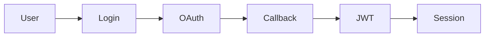

# DesignScribe

> Architecture docs as a side effect of coding.

DesignScribe is a CLI tool that watches your coding agent work and automatically generates architecture documentation, data flow diagrams, and design decision logs — in real-time, as code is written.

## The Problem

You use Claude Code, Cursor, Codex, or other coding agents to write code. They're great at producing code. But after a session, you have new files and **no record of**:

- **Why** this code exists
- **How** data flows through it
- **What** design decisions were made
- **Which** parts of the system are affected

Existing tools (depwire, Graphify, CodeSee) map what exists in your codebase. None of them narrate **what changed and why** as it happens.

## The Solution

DesignScribe sits alongside your coding agent and turns code changes into living documentation:

```
Code Change → Parse → Graph → Narrate → Diagram → Document
```

1. **Detect** — file watcher, git hook, or agent call picks up changes
2. **Parse** — tree-sitter AST extraction (not regex, not text diff)
3. **Map** — dependency graph updated incrementally
4. **Narrate** — LLM summarizes what changed, why, and how data flows
5. **Diagram** — Mermaid flowcharts rendered to images
6. **Document** — everything appended to a living architecture log

## Quick Start

```bash
# Install
pip install designscribe

# Initialize in your project
cd your-project
designscribe init ./src

# Make some changes with your coding agent, then:
designscribe run

# Or watch continuously
designscribe watch ./src
```

## Commands

| Command | Description |
|---------|-------------|
| `designscribe init ./src` | First-time scan — build dependency graph |
| `designscribe diff` | Show structural changes (AST-level, not text) |
| `designscribe narrate` | Generate LLM summary of pending changes |
| `designscribe diagram` | Render Mermaid diagrams to PNG/SVG |
| `designscribe render` | Generate/regenerate `living-arch.md` |
| `designscribe run` | Full pipeline: diff → narrate → diagram → render |
| `designscribe watch ./src` | Continuous mode — auto-run on file changes |
| `designscribe record file1.py --task "Added auth"` | Agent hook — record changes with context |
| `designscribe graph show` | Display the dependency graph |
| `designscribe graph query src/auth.py` | What does this file depend on? |

## Output

Running DesignScribe produces:

```
your-project/
├── living-arch.md              # Living architecture document
├── designscribe-graph.json     # Full dependency graph
├── designscribe-log.jsonl      # Append-only event log
└── diagrams/
    ├── auth-flow-2026-06-21.png
    └── user-model-2026-06-21.png
```

### living-arch.md

A cumulative markdown document with every design decision:

```markdown
# Architecture Log — My Project

## 2026-06-21 10:00 — OAuth2 Authentication Flow

**Summary:** Added OAuth2 login with PKCE support for mobile compatibility.

**Data Flow:**
User → /auth/login → OAuthProvider → callback → JWT → SessionStore

**Impact:** middleware/auth.py, routes/user.py

**Files Changed:** src/auth.py, src/models/user.py



```

## How It Works

### 1. Change Detection (WATCH)

Three modes for different workflows:

- **File Watcher** — `designscribe watch ./src` monitors filesystem in real-time
- **Agent Hook** — coding agent calls `designscribe record` after writing code
- **Git Hook** — post-commit hook triggers analysis on each commit

### 2. Structural Diff (DIFF)

Not a text diff — an **AST diff** using tree-sitter:

```
Text diff:  "+def authenticate(user, password):"  (just a line added)
AST diff:   symbol_added: authenticate (function, line 45, params: user, password)
```

This captures *what* changed at the code structure level, not just which lines were added.

### 3. Dependency Graph (GRAPH)

NetworkX-based directed graph, persisted as JSON:

- **Nodes:** files, functions, classes, modules
- **Edges:** imports, calls, inherits, contains
- **Incremental:** only re-parses changed files
- **Queryable:** "What depends on `authenticate`?" → BFS traversal

Wraps depwire for initial scans, NetworkX for queries.

### 4. LLM Narration (NARRATE)

Sends the structural diff + graph context to an LLM and asks:

1. What was built/changed?
2. Why was it designed this way?
3. How does data flow through the new code?
4. What else might be affected?

Uses OpenRouter by default (configurable). Falls back to a basic summary if LLM is unavailable.

### 5. Diagram Rendering (DIAGRAM)

The LLM generates Mermaid syntax, which is rendered to PNG/SVG via `mmdc` (Mermaid CLI). If mmdc isn't installed, the raw `.mmd` files are saved.

### 6. Living Document (OUTPUT)

Every narration is appended to `living-arch.md` — a cumulative architecture log that grows with your codebase. It's the single source of truth for "why does this code exist?"

## Agent Integration

### Claude Code

Add to your `CLAUDE.md`:

```markdown
## After Writing Code
After creating or modifying files, run:
  designscribe record <changed_files> --task "what you did"
```

### Cursor / Codex / Other MCP Agents

DesignScribe can run as an MCP server (Phase 2), exposing tools like:
- `record_change` — record file changes
- `get_architecture` — retrieve current architecture doc
- `query_dependencies` — explore the dependency graph

### Git Hooks

```bash
# .git/hooks/post-commit
cd /path/to/project && designscribe diff HEAD~1 && designscribe narrate && designscribe render
```

## Configuration

`designscribe.json` in your project root:

```json
{
  "watch": {
    "paths": ["src/"],
    "exclude": ["*.test.*", "*.spec.*", "node_modules/"],
    "debounce_ms": 2000
  },
  "llm": {
    "provider": "openrouter",
    "model": "xiaomi/mimo-v2.5-pro",
    "api_key_env": "OPENROUTER_API_KEY"
  },
  "diagrams": {
    "format": "png",
    "output": "diagrams/"
  },
  "output": {
    "file": "living-arch.md",
    "max_entries": 100
  },
  "graph": {
    "engine": "depwire",
    "incremental": true
  }
}
```

## Architecture

```
┌─────────────────────────────────────────────────────────┐
│                     DesignScribe CLI                     │
├─────────────────────────────────────────────────────────┤
│                                                         │
│  ┌──────────┐   ┌──────────┐   ┌──────────┐           │
│  │  WATCH   │──▶│ ANALYSE  │──▶│ NARRATE  │           │
│  │ (detect  │   │ (parse + │   │ (LLM     │           │
│  │  changes)│   │  graph)  │   │  summary)│           │
│  └──────────┘   └──────────┘   └──────────┘           │
│       │              │              │                   │
│       ▼              ▼              ▼                   │
│  ┌──────────┐   ┌──────────┐   ┌──────────┐           │
│  │  DIFF    │   │  GRAPH   │   │ DIAGRAM  │           │
│  │ (tree-   │   │ (NetworkX│   │ (Mermaid │           │
│  │  sitter) │   │  + deps) │   │  render) │           │
│  └──────────┘   └──────────┘   └──────────┘           │
│                      │              │                   │
│                      ▼              ▼                   │
│                 ┌──────────────────────┐                │
│                 │       OUTPUT         │                │
│                 │  living-arch.md      │                │
│                 │  diagrams/           │                │
│                 │  graph.json          │                │
│                 └──────────────────────┘                │
└─────────────────────────────────────────────────────────┘
```

## Design Principles

1. **Unix philosophy** — composable CLI tools, pipe-friendly, NDJSON interchange
2. **Incremental** — don't re-analyze the whole codebase on every change
3. **Agent-agnostic** — works with any coding agent via file watchers or hooks
4. **Local-first** — no cloud dependencies, everything runs on-machine
5. **Living docs** — output evolves with the code, not a static snapshot

## Building Blocks

DesignScribe composes existing open-source tools:

| Layer | Tool | Role |
|-------|------|------|
| Parse | [tree-sitter](https://tree-sitter.github.io/) | AST extraction (66+ languages) |
| Graph | [NetworkX](https://networkx.org/) | Graph operations & queries |
| Graph | [depwire](https://github.com/depwire/depwire) | Dependency mapping (optional) |
| LLM | [OpenRouter](https://openrouter.ai/) | LLM API (configurable) |
| Diagram | [Mermaid CLI](https://github.com/mermaid-js/mermaid-cli) | Render .mmd → PNG/SVG |
| Git | [GitPython](https://gitpython.readthedocs.io/) | Git integration |
| Watch | [watchdog](https://python-watchdog.readthedocs.io/) | Filesystem monitoring |

## Roadmap

### Phase 1: Core Pipeline (MVP) ✅
- [x] Project structure & CLI scaffold
- [x] Tree-sitter AST differ (Python support)
- [x] NetworkX dependency graph (scan, query, impact analysis)
- [x] LLM narration via OpenRouter (gpt-4o-mini default, auto-fallback)
- [x] Mermaid diagram rendering (mmdc)
- [x] Living architecture doc generation
- [x] `designscribe init` + `designscribe run`
- [x] Event log (append-only JSONL)

### Phase 2: Agent Integration 🚧
- [x] `designscribe watch` — file watcher daemon with debouncing
- [ ] `designscribe record` — agent-callable hook
- [ ] CLAUDE.md / AGENTS.md integration snippets
- [ ] MCP server mode for Cursor, Codex, etc.

### Phase 3: Intelligence
- [x] Incremental graph updates (partial — re-parses changed files)
- [x] Smart debouncing (configurable ms in watcher)
- [ ] Impact analysis (downstream effects)
- [ ] Design pattern detection
- [ ] Multi-language support (TypeScript, Go, Rust)
- [ ] Caching narrations to reduce LLM costs

### Phase 4: Polish
- [ ] HTML output with interactive diagrams
- [ ] GitHub Action (auto-docs on PR)
- [ ] VS Code extension
- [ ] Multiple output formats (Confluence, Notion)

## License

MIT
